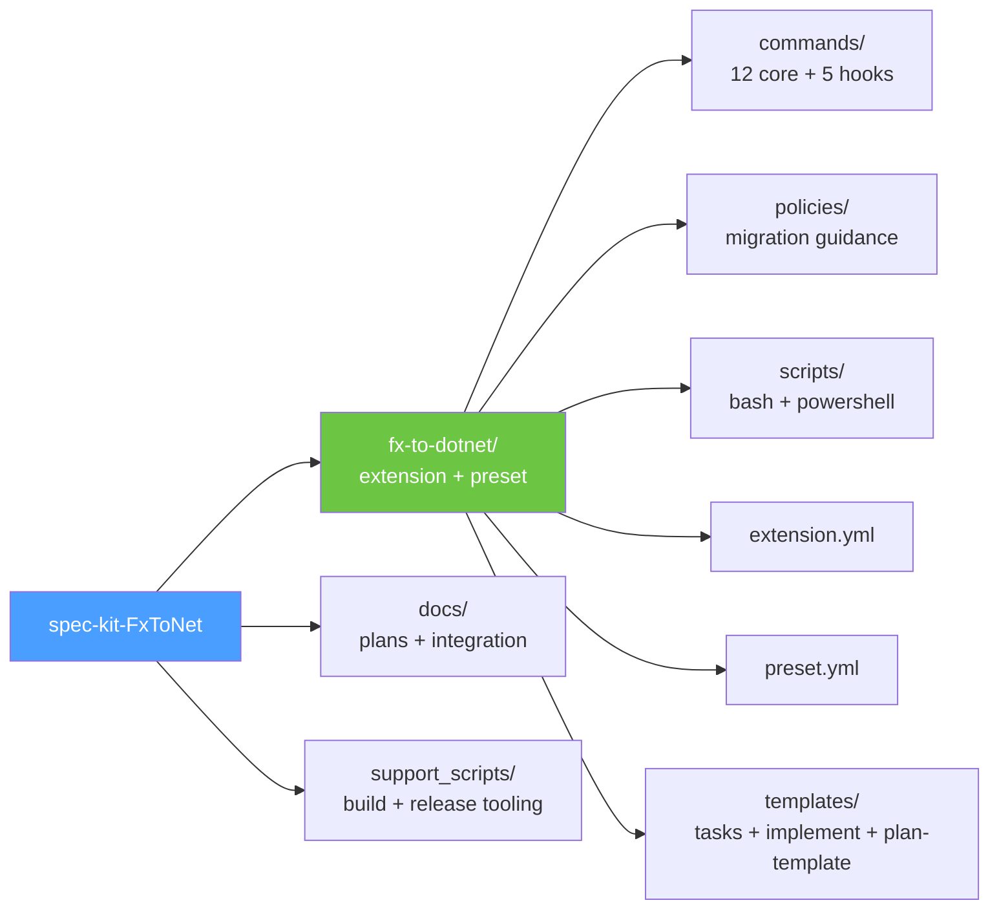
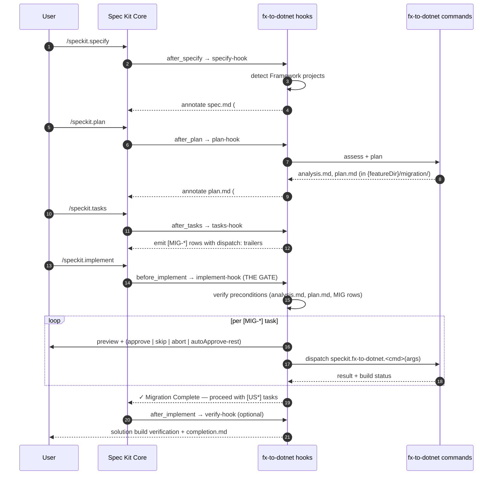
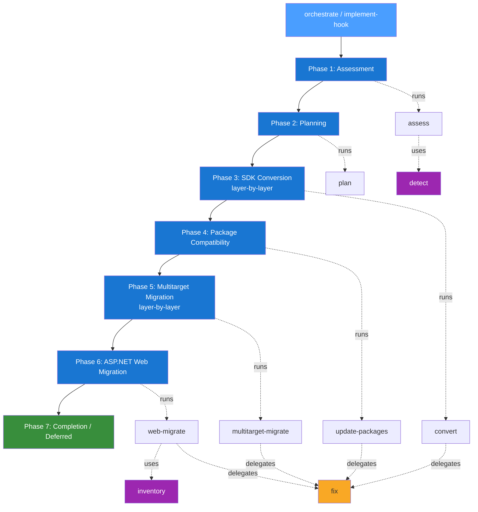

# spec-kit-FxToNet

This repository packages [`fx-to-dotnet`](fx-to-dotnet/README.md) — a single Spec Kit extension that orchestrates migrating .NET Framework applications to modern .NET (default `net10.0`) — together with a companion preset and supporting tooling.

The extension integrates tightly with the Spec Kit lifecycle (`/speckit.specify` → `/speckit.plan` → `/speckit.tasks` → `/speckit.implement`) via five lifecycle hooks. Migration content is owned end-to-end by the extension; user-story implementation is gated behind completion of all migration tasks.

- Extension version: `0.8.0` (see [fx-to-dotnet/extension.yml](fx-to-dotnet/extension.yml))
- Preset version: `0.8.0` (see [fx-to-dotnet/preset.yml](fx-to-dotnet/preset.yml))
- License: MIT
- Author: Microsoft

> [!NOTE]
> A `v0.9.0` **prerelease** is available for early testing. See [Preview Release (Prerelease)](#preview-release-prerelease) at the bottom of this document for details.

## Repository Layout



| Path | Purpose |
|------|---------|
| [fx-to-dotnet/](fx-to-dotnet/README.md) | The Spec Kit extension itself — commands, hooks, policies, scripts — plus the companion `fx-to-dotnet-sdd` preset (manifest at [fx-to-dotnet/preset.yml](fx-to-dotnet/preset.yml), templates under [fx-to-dotnet/templates/](fx-to-dotnet/templates/)) |
| [docs/](docs/) | Design plans: workflow, publish, release pipeline, automated tests, tight-integration plan + tasks |
| [support_scripts/](support_scripts/) | Cross-platform helpers for version bumping, packaging, deploying, catalog generation, and cross-reference auditing |

## Quick Start

```bash
# 1. Install the extension into your Spec Kit project (stable v0.8.0)
specify extension add fx-to-dotnet
#    To try v0.9.0 instead, see "Preview Release (Prerelease)" at the bottom.

# 2. (Optional) Install the companion preset for deterministic core overrides
specify preset add fx-to-dotnet-sdd

# 3. Drive a full migration via the standard Spec Kit lifecycle.
#    Each step fires a fx-to-dotnet hook (see "End-to-End Lifecycle" below).
/speckit.specify  "Migrate MySolution.sln to net10.0"
                             # after_specify    → speckit.fx-to-dotnet.specify-hook    (detect Framework projects, annotate spec.md)
/speckit.plan                # after_plan       → speckit.fx-to-dotnet.plan-hook       (run assess + plan; write analysis.md + plan.md)
/speckit.tasks               # after_tasks      → speckit.fx-to-dotnet.tasks-hook      (emit [MIG-*] rows with dispatch: trailers)
/speckit.implement           # before_implement → speckit.fx-to-dotnet.implement-hook  THE GATE — run every [MIG-*] before [US*]
                             # after_implement  → speckit.fx-to-dotnet.verify-hook     (optional: solution build verification + completion.md)
```

Or invoke the orchestrator directly (no lifecycle hooks):

```bash
speckit.fx-to-dotnet.orchestrate path/to/MySolution.sln net10.0
```

## End-to-End Lifecycle (with Hooks)

The extension defines five hooks. The `before_implement` hook is the **gate**: it refuses to let `speckit.implement` run user-story tasks until every `[MIG-*]` task has been executed, skipped, or aborted.



### Hook Summary

| Event | Hook | Optional? | Role |
|-------|------|-----------|------|
| `after_specify` | `specify-hook` | no | Detect Framework projects; annotate `spec.md` |
| `after_plan` | `plan-hook` | no | Run `assess` + `plan`; produce `analysis.md` + `plan.md`; annotate `plan.md` |
| `after_tasks` | `tasks-hook` | no | Insert `## Phase N: .NET Framework Migration`; emit `[MIG-*]` rows with `dispatch:` trailers |
| `before_implement` | `implement-hook` | **no — THE GATE** | Verify preconditions; per-task review of every `[MIG-*]`; validate `^speckit\.fx-to-dotnet\.` namespace |
| `after_implement` | `verify-hook` | yes | Solution build verification; write `completion.md` |

All mandatory hooks **silent-exit success** on non-Framework workspaces, so they never block ordinary (non-migration) Spec Kit usage.

## 7-Phase Migration Flow

Whether driven by the lifecycle hooks or by `speckit.fx-to-dotnet.orchestrate` directly, the migration always follows the same seven phases:



Layer-by-layer phases (3 and 5) process projects in dependency order: Layer 1 (leaves) first, then Layer 2, etc. Projects within a layer are independent and may run in parallel. Each layer ends in a checkpoint prompt unless `alwaysContinue: true` is recorded in `preferences.md`.

## State Files (per feature)

```mermaid
graph TD
    F[specs/&lt;branch&gt;/]
    F --> Spec[spec.md]
    F --> Plan[plan.md]
    F --> Tasks[tasks.md]
    F --> Mig[migration/]

    Mig --> Shared[Shared artifacts]
    Mig --> Priv[Private extension state]

    Shared --> A[analysis.md<br/>assess output]
    Shared --> PL[plan.md<br/>plan output]
    Shared --> O[orchestration.md<br/>phase tracking]

    Priv --> PU[package-updates.md]
    Priv --> Pref[preferences.md]
    Priv --> Det[detection.md]
    Priv --> IS[implement-state.md]
    Priv --> Comp[completion.md]
    Priv --> Proj[&#123;ProjectName&#125;.md<br/>per-project sections]

    style Shared fill:#6cc644,color:#fff
    style Priv fill:#f9a825
```

As of `v0.7.0`, **all** migration artifacts live under the active Spec Kit feature folder at `specs/<branch>/migration/`. Each feature branch gets its own isolated migration state, and core Spec Kit (`/speckit.analyze`, `/speckit.verify`) discovers shared artifacts by convention.



Per-project state files (`{ProjectName}.md`) contain four sections written by different commands:
`## SDK Conversion` (convert) · `## Build Fix` (fix, transient) · `## Multitarget` (multitarget-migrate) · `## Web Migration` (web-migrate).

## Commands Catalog

The extension provides 12 core commands and 5 lifecycle hooks. See [fx-to-dotnet/README.md](fx-to-dotnet/README.md) for full details.

| Group | Command(s) |
|-------|------------|
| Orchestration | `orchestrate`, `initialize` |
| Phase commands | `assess`, `plan`, `convert`, `update-packages`, `multitarget-migrate`, `web-migrate` |
| Cross-cutting | `fix` (build/fix loop) |
| Utilities | `detect`, `inventory`, `show-policy` |
| Hooks | `specify-hook`, `plan-hook`, `tasks-hook`, `implement-hook`, `verify-hook` |

## `[MIG-*]` Dispatch Format and Validation

The `after_tasks` hook emits one row per granular dispatch unit. Each row carries a machine-readable `dispatch:` trailer that the `before_implement` hook parses and validates.

```
- [ ] [MIG-001] [P0] Convert ProjectA.csproj to SDK-style — dispatch: speckit.fx-to-dotnet.convert(ProjectA.csproj)
- [ ] [MIG-002] [P0] Apply package chunk 1 to LibraryA (3 minor updates) — dispatch: speckit.fx-to-dotnet.update-packages(project=src/LibraryA/LibraryA.csproj, chunk=1)
- [ ] [MIG-003] [P0] Multitarget LibraryA to net10.0       — dispatch: speckit.fx-to-dotnet.multitarget-migrate(LibraryA.csproj)
- [ ] [MIG-004] [P0] Web migrate WebApp slice=bootstrap    — dispatch: speckit.fx-to-dotnet.web-migrate(WebApp.csproj, slice=bootstrap)
```



```mermaid
flowchart TD
    Start([before_implement hook starts]) --> Pre{Preconditions met?<br/>analysis.md + plan.md + MIG rows}
    Pre -- no --> Fail[Exit non-zero<br/>print remediation]
    Pre -- yes --> Loop{Next unchecked<br/>&#91;MIG-*&#93;?}
    Loop -- none --> Done[Append ## Migration Execution Summary<br/>insert ✓ Migration Complete<br/>allow speckit.implement]
    Loop -- yes --> Validate{dispatch: matches<br/>^speckit\.fx-to-dotnet\.?}
    Validate -- no --> Reject[Mark &#91;~&#93;<br/>audit: dispatch-rejected]
    Reject --> Loop
    Validate -- yes --> Ask{User choice}
    Ask -- approve --> Run[Invoke dispatch target]
    Ask -- skip --> Skip[Mark &#91;~&#93;]
    Ask -- abort --> Halt([Halt — leave rows unchecked])
    Ask -- autoApprove-rest --> Run
    Run --> Build{Build OK?}
    Build -- yes --> Mark[Mark &#91;X&#93;]
    Build -- no --> PauseReview[ALWAYS pause for review<br/>even under autoApprove-rest]
    PauseReview --> Ask
    Mark --> Loop
    Skip --> Loop

    style Fail fill:#d32f2f,color:#fff
    style Reject fill:#d32f2f,color:#fff
    style Done fill:#388e3c,color:#fff
    style PauseReview fill:#f9a825
```

The `^speckit\.fx-to-dotnet\.` prefix check is the **technical enforcement that migrations only run extension-owned commands**. Targets that fail this check are rejected with a `dispatch-rejected` audit-log entry.

## Prerequisites

- **Spec Kit** ≥ 0.1.0 (extension); ≥ 0.7.2 (preset and workflows)
- **.NET SDK** (for `dotnet build` via the `fix` command)
- **MCP Servers**:
  - `Microsoft.GitHubCopilot.Modernization.Mcp` — project analysis and SDK-style conversion (required by `assess` and `convert`)

Sample `.mcp.json`:

```json
{
  "servers": {
    "Microsoft.GitHubCopilot.Modernization.Mcp": {
      "type": "stdio",
      "command": "dotnet",
      "args": ["run", "--project", "<path-to-appmod-mcp-server>"]
    }
  }
}
```

## Standalone Usage

Several commands work independently of the full migration suite:

- `speckit.fx-to-dotnet.fix` — iteratively build and fix compilation errors in any .NET project
- `speckit.fx-to-dotnet.detect` — classify any .NET project (SDK-style, web host, service, library, etc.)
- `speckit.fx-to-dotnet.inventory` — extract endpoint inventory from any legacy ASP.NET web project
- `speckit.fx-to-dotnet.show-policy` — view a named migration policy document

## Documentation

- [fx-to-dotnet extension README](fx-to-dotnet/README.md) — extension-level details, commands, hooks, state files (also covers the bundled `fx-to-dotnet-sdd` preset)
- [docs/speckit-tight-integration-plan.md](docs/speckit-tight-integration-plan.md) — the integration design plan
- [docs/release-pipeline-plan.md](docs/release-pipeline-plan.md) — release pipeline
- [docs/publish-plan.md](docs/publish-plan.md) — publishing plan
- [docs/automated-test-plan.md](docs/automated-test-plan.md) — automated test plan

## Preview Release (Prerelease)

> **`v0.9.0` is available as a [prerelease](https://github.com/RogerBestMsft/spec-kit-FxToNet/releases/tag/v0.9.0).** It is cut from the [`migrate-spec`](https://github.com/RogerBestMsft/spec-kit-FxToNet/tree/migrate-spec) branch and is **not** the latest stable release (`v0.8.0`). Use it to try the upcoming features; expect breaking changes before it is promoted to a stable release.

The `v0.9.0` preview advances both the extension and the companion preset to `0.9.0` and focuses on MCP-driven analysis and tighter Spec Kit integration:

- **MCP preflight gate** — a new `speckit.fx-to-dotnet.mcp-preflight` command plus connectivity-check scripts verify the `Microsoft.GitHubCopilot.Modernization.Mcp` server is reachable before a migration starts.
- **Transitive dependency closure** — paired `get-transitive-dependency-closure` scripts compute the full dependency graph to drive layer-by-layer SDK conversion and cross-project version alignment.
- **New policies** — `conditional-compilation` and `cross-project-version-alignment`; `mcp-setup` is restructured into a standard policy folder (`policies/mcp-setup/POLICY.md`).
- **Tighter lifecycle integration** — preset overrides now include `specify` and `plan` templates, enabling a specify-driven flow where migration context is captured up front.
- **Multitarget improvements** — refined `speckit.fx-to-dotnet.multitarget-migrate` handling and cross-project version reconciliation.

### Try the prerelease

There are three ways to run `v0.9.0`. **Option A** is recommended for most users.

#### Option A — Install the published release asset (recommended)

The `v0.9.0` release attaches a packaged `fx-to-dotnet.zip` plus `SHA256SUMS.txt`:

```bash
# 1. Download the packaged extension + checksum from the v0.9.0 prerelease
curl -LO https://github.com/RogerBestMsft/spec-kit-FxToNet/releases/download/v0.9.0/fx-to-dotnet.zip
curl -LO https://github.com/RogerBestMsft/spec-kit-FxToNet/releases/download/v0.9.0/SHA256SUMS.txt

# 2. Verify the download
sha256sum -c SHA256SUMS.txt

# 3. Extract — the zip contains a single top-level fx-to-dotnet/ folder
unzip fx-to-dotnet.zip

# 4. Install the extracted folder (the bundle ships both the extension and the preset)
specify extension add --dev ./fx-to-dotnet
specify preset add --dev ./fx-to-dotnet
```

#### Option B — Windows PowerShell

Same as Option A, using `Invoke-WebRequest` and `Expand-Archive` for the download and extract steps:

```powershell
Invoke-WebRequest https://github.com/RogerBestMsft/spec-kit-FxToNet/releases/download/v0.9.0/fx-to-dotnet.zip -OutFile fx-to-dotnet.zip
Expand-Archive fx-to-dotnet.zip -DestinationPath .
specify extension add --dev .\fx-to-dotnet
specify preset add --dev .\fx-to-dotnet
```

#### Option C — Track the branch directly

Clone the `migrate-spec` branch and install from the checkout (useful for following ongoing changes):

```bash
git clone --branch migrate-spec https://github.com/RogerBestMsft/spec-kit-FxToNet.git
specify extension add --dev ./spec-kit-FxToNet/fx-to-dotnet
specify preset add --dev ./spec-kit-FxToNet/fx-to-dotnet
```

Once `v0.9.0` is promoted to a stable release, the version bullets near the top of this document will be updated and this section will be removed. See the [CHANGELOG](CHANGELOG.md) and the [releases page](https://github.com/RogerBestMsft/spec-kit-FxToNet/releases) for the full history.

## License

MIT — see [LICENSE](LICENSE).
