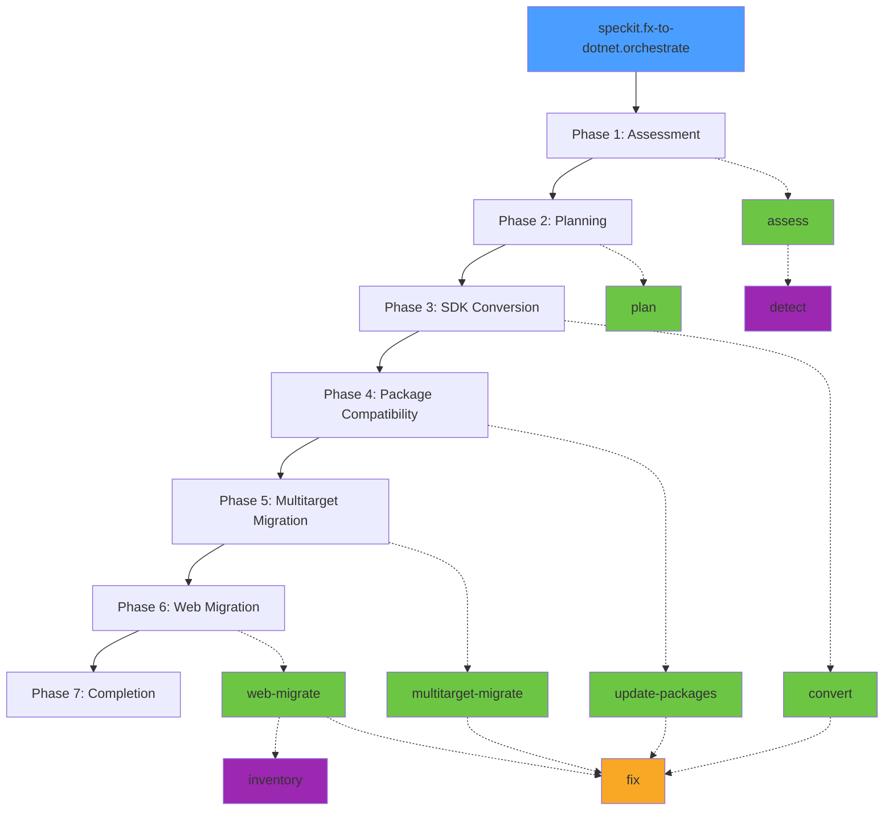

# fx-to-dotnet

A **single Spec Kit extension** that orchestrates migrating .NET Framework applications to modern .NET (e.g. .NET 10) through a 7-phase workflow.

## Phase Diagram



## Commands

| Command | Description |
|---------|-------------|
| `speckit.fx-to-dotnet.orchestrate` | Orchestrator — drives the 7-phase migration flow |
| `speckit.fx-to-dotnet.assess` | Phase 1: Assessment |
| `speckit.fx-to-dotnet.plan` | Phase 2: Migration planning |
| `speckit.fx-to-dotnet.convert` | Phase 3: SDK-style conversion |
| `speckit.fx-to-dotnet.fix` | Cross-cutting: build/fix loop |
| `speckit.fx-to-dotnet.update-packages` | Phase 4: Package compatibility |
| `speckit.fx-to-dotnet.multitarget-migrate` | Phase 5: Multitarget migration |
| `speckit.fx-to-dotnet.web-migrate` | Phase 6: ASP.NET web migration |
| `speckit.fx-to-dotnet.detect` | Utility: project type detection |
| `speckit.fx-to-dotnet.inventory` | Utility: legacy route extraction |
| `speckit.fx-to-dotnet.show-policy` | Shared policies + reference docs |

## Install

```bash
specify extension add fx-to-dotnet
```

### Dev Install (from local checkout)

```bash
specify extension add --dev /path/to/fx-to-dotnet
```

## Prerequisites

- **Spec Kit** >= 0.1.0
- **.NET SDK** (for `dotnet build` via the fix command)
- **MCP Servers** (required by assess and convert commands):
  - `Microsoft.GitHubCopilot.AppModernization.Mcp` — project analysis and SDK conversion
- **Skills** (bundled in the repo, used by assess and convert commands):
  - `dependency-layers` — dependency layer computation algorithm
  - `nuget-package-compat` — NuGet package compatibility analysis scripts

### Sample MCP Configuration (`.mcp.json`)

```json
{
  "servers": {
    "Microsoft.GitHubCopilot.AppModernization.Mcp": {
      "type": "stdio",
      "command": "dotnet",
      "args": ["run", "--project", "<path-to-appmod-mcp-server>"]
    }
  }
}
```

## Command Dependency Graph

```
orchestrate
├── assess
│   ├── detect
│   └── (policies)
├── plan
│   └── (policies)
├── convert
│   └── fix
│       └── (policies)
├── update-packages
│   └── fix
├── multitarget-migrate
│   ├── fix
│   └── (policies)
└── web-migrate
    ├── inventory
    ├── fix
    └── (policies)
```

## Standalone Usage

Some commands can be used independently outside the full migration suite:

- **`speckit.fx-to-dotnet.fix`** — Useful for any .NET project; iteratively builds and fixes compilation errors
- **`speckit.fx-to-dotnet.detect`** — Classifies any .NET project (SDK-style, web host, service, library, etc.)
- **`speckit.fx-to-dotnet.inventory`** — Extracts endpoint inventory from any legacy ASP.NET web project

## License

MIT
