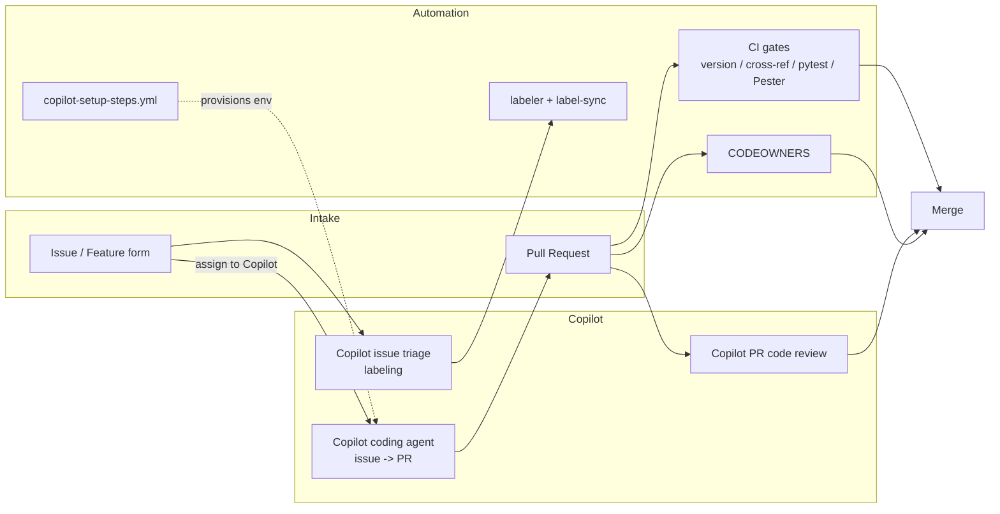
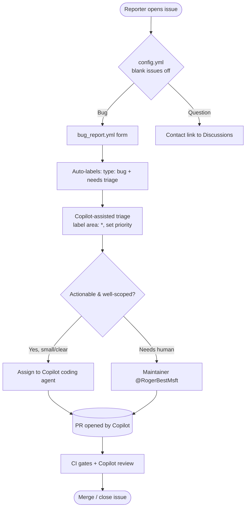
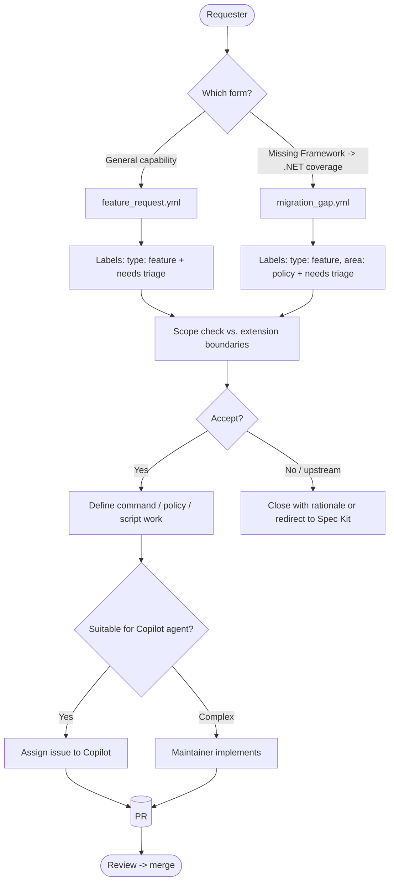
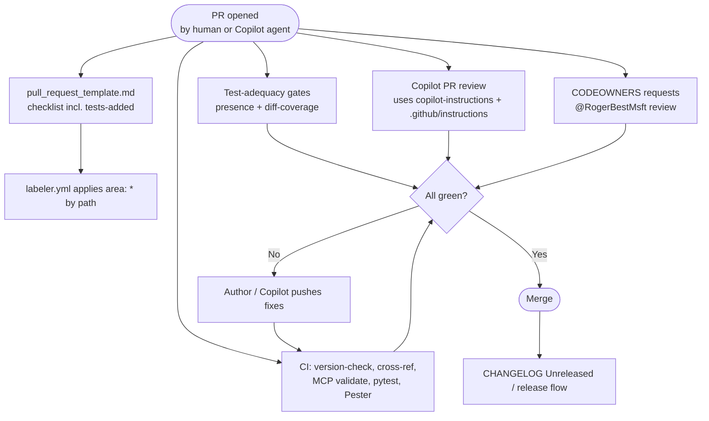
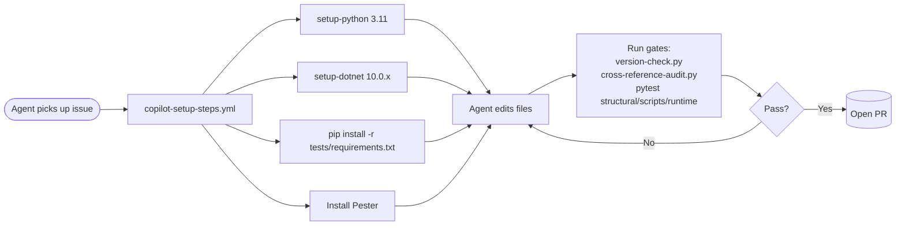
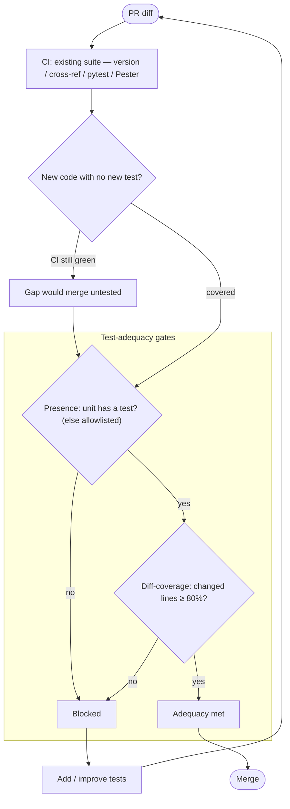

# Plan for Review — Copilot-Ready Issue / Feature / PR Handling

> Status: **Proposal for review.** This document describes the scaffolding to add to
> `spec-kit-FxToNet` so that issues, feature requests, and pull requests are handled
> efficiently, with GitHub Copilot integrated at three points: the **coding agent**
> (issue → PR), **PR code review**, and **issue triage/labeling**.

## 1. Goals

- Give reporters structured intake so issues carry enough context for a human **or**
  Copilot to act without back-and-forth.
- Let the **Copilot coding agent** run this repo's CI gates inside its ephemeral
  environment, so the PR it opens is already green.
- Route work automatically (labels + CODEOWNERS) so triage is fast.
- Keep within repo scope discipline: **docs / markdown / YAML / scripts / tests only** —
  no application build, no new runtime dependencies.

## 2. Current state vs. gaps

| Capability | Today | Gap to close |
|---|---|---|
| AI agent guidance | Strong [.github/copilot-instructions.md](../.github/copilot-instructions.md) + 5 path-scoped instruction files | Add an issue-driven "Definition of Done" section |
| CI gates | [ci.yml](../.github/workflows/ci.yml): version-check, cross-ref audit, MCP validate, pytest, Pester | None — reuse as the agent's checklist |
| Coding-agent environment | _none_ | `copilot-setup-steps.yml` to preinstall Python/.NET/deps |
| Issue intake | Raw blank issues | Issue **forms** (bug / feature / migration gap) + config |
| PR intake | Blank PR | `pull_request_template.md` with CI checklist |
| Triage/routing | _none_ | `labels.yml` + label-sync, `labeler.yml`, `CODEOWNERS` |
| Security/governance | _none_ | `SECURITY.md` + CONTRIBUTING triage section |

## 3. Where Copilot plugs in

## 4. Workflow — Bug report / issue

## 5. Workflow — Feature request / migration gap

## 6. Workflow — Pull request

> **Test adequacy** is enforced on every PR by two gates described in
> [§12](#12-automated-test-adequacy-verification): a **presence** check (new
> script/command/hook must have a test) and a **diff-coverage** check (the PR's changed
> lines must be exercised by tests).

## 7. Coding-agent environment

The Copilot coding agent runs in an ephemeral Linux container. To open a green PR it must
reproduce the CI gates, so `copilot-setup-steps.yml` mirrors [ci.yml](../.github/workflows/ci.yml).

> The setup job's id **must** be exactly `copilot-setup-steps` for GitHub to use it.

## 8. Deliverables

### Phase 1 — Coding-agent enablement
- `.github/workflows/copilot-setup-steps.yml` — job `copilot-setup-steps`, ubuntu-latest,
  SHA-pinned actions, installs Python 3.11 + .NET 10 + `tests/requirements.txt` + Pester.
- Edit [.github/copilot-instructions.md](../.github/copilot-instructions.md) — add
  "Working from an issue" + "Definition of Done before opening a PR" (run the validate
  block; update both READMEs + CHANGELOG Unreleased when relevant).

### Phase 2 — Structured intake
- `.github/ISSUE_TEMPLATE/config.yml` — blank issues off; contact links.
- `.github/ISSUE_TEMPLATE/bug_report.yml` — repro, command/hook/policy, OS+shell
  (PS 5.1 vs 7), gate output. Labels: `type: bug`, `needs triage`.
- `.github/ISSUE_TEMPLATE/feature_request.yml` — problem, proposed command/policy/script,
  scope check. Labels: `type: feature`, `needs triage`.
- `.github/ISSUE_TEMPLATE/migration_gap.yml` — missing Framework → modern .NET coverage.
  Labels: `type: feature`, `area: policy`, `needs triage`.
- `.github/pull_request_template.md` — checklist mirroring CI gates.

### Phase 3 — Triage & routing
- `.github/labeler.yml` + `.github/workflows/labeler.yml` (actions/labeler, SHA-pinned) —
  PR path globs → `area:` labels.
- `.github/labels.yml` + `.github/workflows/labels-sync.yml`
  (`EndBug/label-sync`, SHA-pinned) — canonical taxonomy.
- `.github/CODEOWNERS` — all mapped paths → `@RogerBestMsft`.

### Phase 4 — Governance & security
- `SECURITY.md` — responsible disclosure (scripts / supply chain).
- Edit [CONTRIBUTING.md](../CONTRIBUTING.md) — add "Reporting issues & triage" and
  "PR review expectations" sections.

### Phase 5 — Settings (documented, not committed)
- Enable Copilot coding agent + assign issues to it.
- Enable Copilot automatic PR review.
- MCP allow-list note for the agent environment.

## 9. Label taxonomy

| Group | Labels |
|---|---|
| type | `type: bug`, `type: feature`, `type: docs`, `type: question` |
| area | `area: command`, `area: policy`, `area: script`, `area: manifest`, `area: tests`, `area: ci`, `area: preset` |
| workflow | `needs triage`, `good first issue`, `help wanted`, `breaking-change`, `copilot` |

## 10. Decisions

- **CODEOWNERS owner:** `@RogerBestMsft` (all paths).
- **Label sync:** single SHA-pinned `EndBug/label-sync` driven by `.github/labels.yml`.
- **Dependabot:** excluded — GitHub Actions are already SHA-pinned.
- **Test-adequacy depth:** Option B — **presence gate + diff-coverage gate** (mutation
  testing deferred).
- **Test-only dependencies:** accepted (`coverage`, `pytest-cov`, `diff-cover`, `kcov`).
  The "no new dependencies" rule applies to the shipped extension, not the test harness.
- **Diff-coverage threshold:** **80%** of changed lines; **report-only for one release,
  then blocking**.
- **Bash coverage:** via `kcov` (apt) in CI and the agent environment.

## 11. Verification (mirrors CI)

1. `python support_scripts/version-check.py` and
   `python support_scripts/cross-reference-audit.py` still pass (no version files touched).
2. `pytest tests/structural tests/scripts` green.
3. All new YAML (workflows + issue forms) parses and uses valid GitHub form schema.
4. `copilot-setup-steps.yml` job id is exactly `copilot-setup-steps`.
5. Presence gate fails when a dummy script ships without a test, and passes once removed.
6. `diff-cover` dry-run reports changed-line coverage on a sample branch.

## 12. Automated test-adequacy verification

True test *adequacy* (do the tests meaningfully exercise the change?) cannot be fully
machine-proven — it remains a review judgment. But the PR process enforces two automatable
proxies so a change cannot merge **untested**, and adds deeper signals over time.

### Why CI alone is not enough

CI runs the *existing* suite; it stays green even when new code ships with zero tests.
The gates below close that gap.

### Phase 1 — Presence gate (no new deps; ship first)

- New structural test `tests/structural/test_test_coverage_presence.py`: every declared
  script (`extension.yml` `scripts:` + `support_scripts/` helpers) is referenced by a
  test, and every hook command is referenced by a `tests/runtime/` test — else CI fails.
- Documented exceptions live in `tests/coverage-exceptions.yml` (`path` + `reason`).
- Mirrors existing structural-test style; makes "no test at all" a hard failure.

### Phase 2 — Diff-coverage gate (ties incoming tests to the change)

- Produce coverage per language on PRs: Python via `coverage.py` (Cobertura), PowerShell
  via Pester's built-in CodeCoverage (JaCoCo), bash via `kcov` (Cobertura).
- Feed all reports to `diff-cover` with an **80% changed-line** threshold in a new
  `coverage` job in [ci.yml](../.github/workflows/ci.yml). **Report-only for one release,
  then blocking.**
- Add `coverage`, `pytest-cov`, `diff-cover` to [tests/requirements.txt](../tests/requirements.txt)
  and install `kcov` + coverage tools in
  [copilot-setup-steps.yml](../.github/workflows/copilot-setup-steps.yml) so the agent
  self-checks before opening a PR.

### Phase 3 — Reporting (optional)

- Overall coverage floor; upload XML/HTML artifacts; optional PR-comment summary.

### Phase 4 — Mutation testing (deferred; scheduled, not per-PR)

- `mutmut`/`cosmic-ray` against the Python `support_scripts/*.py` on a weekly/label
  trigger; report surviving mutants. Optional custom marker-mutation harness for bash/PS
  contracts (flip an exit code / drop a `::marker::` echo, assert the suite goes red).

### Files

- `tests/structural/test_test_coverage_presence.py` (new) — presence invariant.
- `tests/coverage-exceptions.yml` (new) — documented exceptions.
- [.github/workflows/ci.yml](../.github/workflows/ci.yml) — new `coverage` job; enable
  Pester CodeCoverage.
- [.github/workflows/copilot-setup-steps.yml](../.github/workflows/copilot-setup-steps.yml)
  — install kcov + coverage tools.
- [tests/requirements.txt](../tests/requirements.txt) — test-only coverage deps.
- [.github/instructions/tests.instructions.md](../.github/instructions/tests.instructions.md),
  `tests/README.md` — document the gates.
