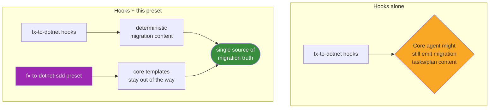

# fx-to-dotnet-sdd Preset

Companion Spec Kit preset for the [`fx-to-dotnet`](../../fx-to-dotnet/README.md) extension.

- **Version**: `0.8.0`
- **Requires**: `speckit_version >= 0.7.2`, extension `fx-to-dotnet >= 0.8.0`
- **License**: MIT

## What it does

The preset overrides three core Spec Kit assets so the core agent never emits competing migration content. It is **Layer 4** of the tight integration plan — the deterministic backstop on top of the extension's lifecycle hooks.

| Override | Path | Effect |
|----------|------|--------|
| `commands/tasks.md` | [templates/commands/tasks.md](templates/commands/tasks.md) | Core `speckit.tasks` no longer emits migration tasks; the `tasks-hook` owns `[MIG-*]` rows |
| `commands/implement.md` | [templates/commands/implement.md](templates/commands/implement.md) | Core `speckit.implement` defers all `[MIG-*]` rows to the `before_implement` hook |
| `templates/plan-template.md` | [templates/plan-template.md](templates/plan-template.md) | Plan template reserves the `## .NET Migration Plan` section for the `plan-hook` |

## How it fits



Hooks alone work without the preset. Install the preset when you want a deterministic guarantee that core never emits competing migration content (recommended for shared / production use).

## Install

```bash
specify preset add fx-to-dotnet-sdd
```

Or, from a local checkout:

```bash
specify preset add --dev /path/to/presets/fx-to-dotnet-sdd
```

## Layout

```
presets/fx-to-dotnet-sdd/
├── preset.yml                       # manifest
└── templates/
    ├── plan-template.md             # overrides core templates/plan-template.md
    └── commands/
        ├── tasks.md                 # overrides core commands/tasks.md
        └── implement.md             # overrides core commands/implement.md
```

## See also

- [fx-to-dotnet extension README](../../fx-to-dotnet/README.md)
- [Tight integration plan](../../docs/speckit-tight-integration-plan.md)
- [Tight integration tasks](../../docs/speckit-tight-integration-tasks.md)
